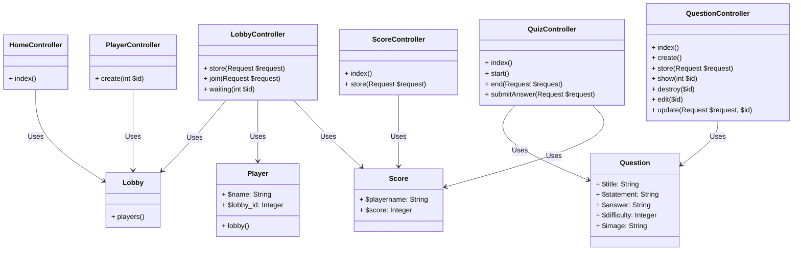

```mermaid
classDiagram
    class HomeController {
        + index()
    }

    class LobbyController {
        + store(Request $request)
        + join(Request $request)
        + waiting(int $id)
    }

    class PlayerController {
        + create(int $id)
    }

    class QuestionController {
        + index()
        + create()
        + store(Request $request)
        + show(int $id)
        + destroy($id)
        + edit($id)
        + update(Request $request, $id)
    }

    class QuizController {
        + index()
        + start()
        + end(Request $request)
        + submitAnswer(Request $request)
    }

    class ScoreController {
        + index()
        + store(Request $request)
    }

    class Lobby {
        + players()
    }

    class Player {
        + lobby()
        + $name: String
        + $lobby_id: Integer
    }

    class Question {
        + $title: String
        + $statement: String
        + $answer: String
        + $difficulty: Integer
        + $image: String
    }

    class Score {
        + $playername: String
        + $score: Integer
    }

    HomeController --> Lobby : Uses
    LobbyController --> Lobby : Uses
    LobbyController --> Player : Uses
    LobbyController --> Score : Uses
    PlayerController --> Lobby : Uses
    QuestionController --> Question : Uses
    QuizController --> Question : Uses
    QuizController --> Score : Uses
    ScoreController --> Score : Uses

```
