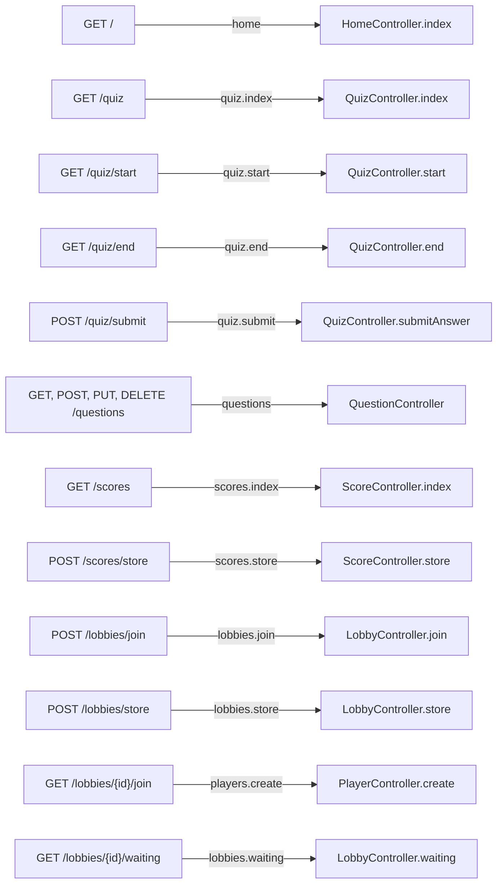

```mermaid
graph LR
    home[GET /] --home--> HomeController.index
    quiz[GET /quiz] --"quiz.index"--> QuizController.index
    quiz_start[GET /quiz/start] --quiz.start--> QuizController.start
    quiz_end[GET /quiz/end] --"quiz.end"--> QuizController.end
    quiz_submit[POST /quiz/submit] --"quiz.submit"--> QuizController.submitAnswer
    questions_resource[GET, POST, PUT, DELETE /questions] --"questions"--> QuestionController
    scores_index[GET /scores] --"scores.index"--> ScoreController.index
    scores_store[POST /scores/store] --"scores.store"--> ScoreController.store
    lobbies_join[POST /lobbies/join] --"lobbies.join"--> LobbyController.join
    lobbies_store[POST /lobbies/store] --"lobbies.store"--> LobbyController.store
    players_create["GET /lobbies/{id}/join"] --"players.create"--> PlayerController.create
    lobbies_waiting["GET /lobbies/{id}/waiting"] --"lobbies.waiting"--> LobbyController.waiting
```
